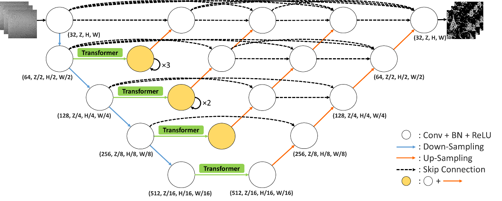

# DenT: Dense-Transformer for 3D Biomedical Image Segmentation



## Requirements

All of the processes are trained on Taiwan Computing Cloud (TWCC) and with an NVIDIA graphics card (NVIDIA V100). It is recommended to install latest drivers and use the GPU with 24+ GB of RAM.

## Environment setup

- Recommend: Install [Miniconda](https://conda.io/miniconda.html) for environment control.
- Create a Conda environment for the platform:

  ``` shell
  python=3.10
  torch=1.13.1+cu116
  ```

## Data

1. Data is currently available [here](https://drive.google.com/drive/folders/10LJxPudM3GWgYvN6Rz-DhLWFRMt4WJLD?usp=sharing)
2. Unzip to the `./data/` directory, you should see data inside `./data/DenT/`

- If you want to train with your own data, please put your dataset `***` inside `./data/`. target dataset and source dataset should be named as `./data/***/train/target`and`./data/***/train/source`.
- Create your own testing set and validation set by running the following script:

    ```shell
    python split_data.py
    ```

- you should now see 3 folders inside the `./data/***` (train, test, val), each consists of the folder `target` and `source`.

## Train

1. Open `./script/train.sh`, and find the section below

    ```bash
    # variables
    target="target" # options: target / target_dna
    model="CusDenT" # options: (DenT) DenT, CusDenT(revision)
    data_root="../data"
    result_root="../results"
    ```

2. Modify `target` and `model` variables (`--random_seed` and `--use_multiheads` are the arguments for `CusDenT`)
3. Run `train.sh`

    ``` shell
    cd script
    bash train.sh
    ```

4. After training progress, you should see the results looks like the following structure

    ```txt
    results/[target]/[model]_[target]_3D_15725_[n]
     |
     | --- checkpoints
     |  | --- model_CusDenT_[n]_pth.tar
     |  | --- ...
     |  | --- model_CusDenT_best_pth.tar
     |
     | --- seg_results (empty)
     | --- [datetime]_args.toml
     | --- events.out.tfevents
    ```

- If your data is on the other place, you should modify `data_root` to redirect to the files
- To save the results to the other place, please change `result_root`

## Predict the structures with the trained model

1. Open `./script/test.sh`, and find the section below

    ```bash
    # variables
    target="target" # options: target / target_dna
    model="CusDenT" # options: (DenT) DenT, CusDenT(revision)
    data_root="../data"
    result_root="../results"
    record_dir="CusDenT_target_3D_15725_1" # change result dir
    ```

2. Modify `record_dir`, `target` and `model` variables

   - `record_dir` should be `[model]_[target]_3D_15725_[n]`
   - `target` and `model` should match to `record_dir`

3. Run `test.sh`

    ``` shell
    cd script
    bash test.sh
    ```

4. Now, there should be some images generated in `seg_results` directory

## Evaluate Model Performance

1. Open `./script/calcu_score.sh`, and find the section below

    ```bash
    # variables
    target="target" # options: target / target_dna
    model="CusDenT" # options: (DenT) DenT, CusDenT(revision)
    data_root="../data"
    result_root="../results"
    record_dir="CusDenT_target_3D_15725_1" # change result dir
    ```

2. Let variables section as same as in `test.sh`
3. Run `calcu_score.sh`

    ``` shell
    cd script
    bash calcu_score.sh
    ```

## Reference

- [Google ViT](https://github.com/google-research/vision_transformer)
- [TransUNet](https://github.com/Beckschen/TransUNet)

## Citations

```bibtex
```
